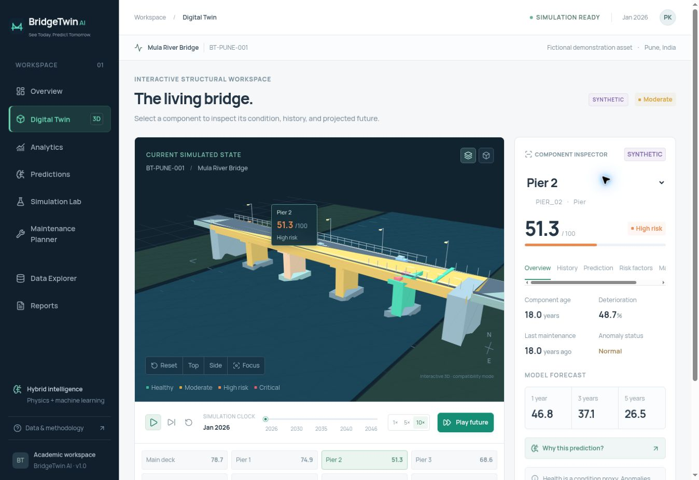
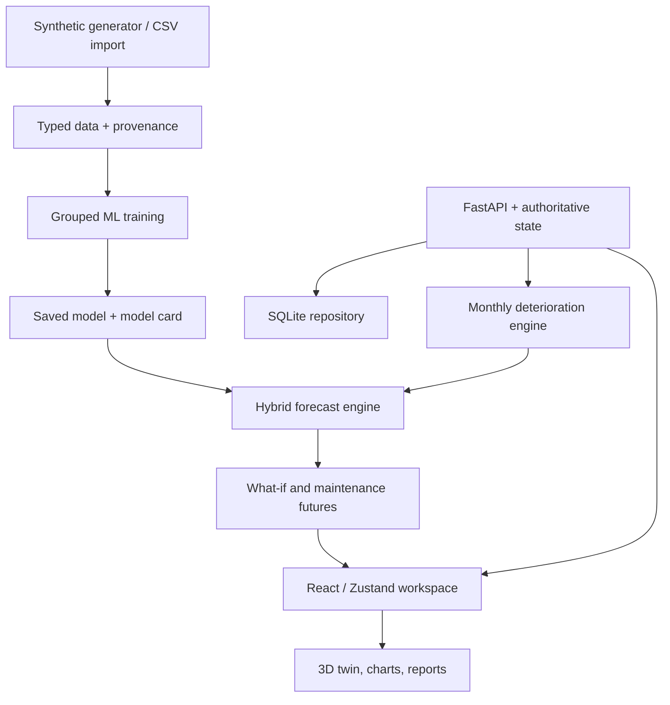

# BridgeTwin AI

**Hybrid AI-Powered Digital Twin for Predictive Bridge Health and Maintenance Optimization**  
*See Today. Predict Tomorrow.*

A working, local-first final-year engineering project: a FastAPI backend, an interactive React/Three.js bridge, a reproducible data generator, trained scikit-learn models, what-if forecasts, and a mixed-integer maintenance optimizer. No paid APIs, LLMs, sensors, or cloud account are needed for the core application.

## Start here — Windows

Install **Python 3.12** and **Node.js 22 LTS or newer**, with both on PATH. Extract the complete ZIP before running commands.

Double-click **`Start-BridgeTwin.cmd`** in the extracted `BridgeTwin-AI` folder, or open PowerShell there and run:

```powershell
powershell -ExecutionPolicy Bypass -File .\Start-BridgeTwin.ps1
```

This process-scoped command does not change the machine's execution policy. The launcher creates an isolated Python environment, installs dependencies on the first run, and starts the real backend and frontend. Open **http://localhost:5173**. Stop with **Ctrl+C**. First-time installation needs an internet connection; normal use is local afterward.

If your institution blocks PowerShell scripts, use the manual commands below. Linux/macOS: `bash start.sh`.

For the presentation walkthrough and questions to prepare, read [the demo guide](docs/DEMO_GUIDE.md). The included [validation record](docs/VALIDATION.md) explains what was verified and the remaining platform limits.

## The problem and solution

Periodic inspection alone does not provide a continuously explorable view of deterioration or maintenance alternatives. BridgeTwin AI links a condition state to an interactive structural model, predicts its modeled future, and compares interventions under a budget. This implementation is a **simulation-driven digital twin prototype**, with a future observation adapter boundary; it is not a sensor-connected replica or a structural certification system.

The demo asset, **Mula River Bridge / BT-PUNE-001**, is fictional. Its geometry, history, coefficients, intervention costs, and recovery assumptions are illustrative. The initial dataset is entirely synthetic. No dataset is represented as public or real unless explicitly supplied and labeled by a user.

## What is implemented

| Workspace | Working functionality |
|---|---|
| Overview | Shared condition KPIs, component priorities, 3D preview, trends, operating inputs, recent scenarios |
| Digital Twin | Eight mapped component IDs; orbit, zoom, pan, click/hover, top/side/reset/focus cameras; component inspector; live simulation clock |
| Analytics | Historical and predicted trends, component comparisons, condition distribution, operating-input scatter plots, maintenance history |
| Predictions | 1/3/5-year forecasts, residual reference bands, model comparison, measured holdout metrics and baselines |
| Simulation Lab | Input sliders, scenario presets, isolated what-if calculation, baseline comparison, applied operating inputs |
| Maintenance Planner | Interventions, INR budgets, exact MILP optimization, user-selected plan, counterfactual trajectories, simulated repairs |
| Data Explorer | Provenance filters, features, missing values, row previews, CSV upload, template, model-development record |
| Reports | Print-friendly assessment, scenario and maintenance history, data provenance, limitations, JSON export |

The 3D bridge includes a deck, road, four piers, bearings, joints, railings, abutments, lamps, river, lane markings, and vehicles. **WebGL mode** uses React Three Fiber with lighting, shadows and moving vehicles. **Compatibility mode** uses Three.js SVGRenderer to project an actual 3D scene, with orbit controls, raycast selection, and camera presets, when WebGL is unavailable. It is not a flat bridge picture. Traffic animation is visual context, not a vehicle-level structural simulation.



## Architecture



One versioned backend snapshot holds the bridge, components, environment, clock, history, and maintenance history. The UI retrieves one consistent view. Predictions are derived from that view. Hypothetical runs never overwrite imported observations. Explicit scenario application changes operating assumptions; explicit repair application changes simulated condition. See [technical architecture](docs/ARCHITECTURE.md).

## Technology

- React 19, Vite 7, JavaScript, Tailwind CSS 4, custom design tokens, Zustand.
- Three.js, React Three Fiber, Drei; Recharts; Lucide; locally bundled Manrope font.
- Python 3.12, FastAPI, Pydantic, Uvicorn; SQLAlchemy and SQLite.
- NumPy, pandas, scikit-learn, joblib; Random Forest, Gradient Boosting, Isolation Forest.
- SciPy/HiGHS mixed-integer optimization. No XGBoost/SHAP requirement.

## Manual installation

Backend, in terminal 1:

```powershell
cd backend
python -m venv .venv
.\.venv\Scripts\python.exe -m pip install -r requirements.txt
.\.venv\Scripts\python.exe -m uvicorn app.main:app --reload
```

Frontend, in terminal 2, starting from the project root:

```powershell
cd frontend
npm.cmd ci
npm.cmd run dev
```

Open http://localhost:5173. API documentation: http://127.0.0.1:8000/docs.

You do not have to activate the virtual environment when invoking its Python executable directly. On Linux/macOS substitute `.venv/bin/python` for `.venv\Scripts\python.exe`.

After installation, **`npm run dev` from the project root** starts both services together. It reuses an already-running BridgeTwin API if one is available.

## Data and simulation methodology

The bundled dataset contains **15,360** observations: 160 independently seeded bridge trajectories × 8 components × 12 annual transitions. Ten scenario families include normal operation, traffic/loading stress, environmental exposure, aging, delayed care, and recovery. Noise perturbs deterioration rates; health is never sampled independently from a uniform distribution.

Condition evolves through a monthly integrator using age, traffic, heavy vehicles, exposure, rainfall, temperature, cumulative load, material susceptibility, maintenance delay, and decaying protection. Coefficients are **engineering-inspired assumptions**, not fitted physical laws, finite-element analysis, or calibrated structural stress models. Details and equations: [methodology](docs/METHODOLOGY.md).

Risk categories are configurable in `backend/app/config.py`: Healthy ≥80, Moderate ≥60, High risk ≥40, Critical <40. The weighted bridge score can obscure a weak individual component, so the UI separately displays worst components and intervention priority. Risk is a condition proxy, not failure probability.

The clock advances one simulated month per step. Play repeats steps; 1×/5×/10× advance 1/5/10 months per cycle. Seasonal operating inputs evolve deterministically. Play Future uses 10×. The demonstration clock spans January 2026 to January 2046.

## Machine learning and explainability

Random Forest and Gradient Boosting compete on independent validation bridges. Regressors learn **annual deterioration**, then reconstruct next-year health from current health. This avoids presenting a model that mainly copies its lagged health input as an explanatory success. Inference enforces 0–100 bounds and non-increasing health without an intervention.

The forecast blends **65% equation-based condition and 35% model prediction**, an explicit demonstration choice rather than an optimized scientific constant. The model card records the raw ML and hybrid scores, physics and persistence baselines, feature ranges, training date, version, and actual split counts. Test bridges are not used for model selection. Calibration bridges are separate.

One-year bands use absolute calibration residuals at the 90th percentile. They do not capture model misspecification or real bridge uncertainty. Group dependence limits nominal-coverage claims. Multi-year bands widen by √horizon and are explicitly illustrative. Global feature importance and one-variable reference sensitivities are computed, labeled correctly, and not presented as local causal contributions. Isolation Forest flags unusual inputs, not damage.

## Reproduce data and models

From `backend`, after installing its environment:

```powershell
.\.venv\Scripts\python.exe scripts/generate_synthetic.py --bridges 160 --seed 42
.\.venv\Scripts\python.exe scripts/train_models.py
.\.venv\Scripts\python.exe scripts/evaluate_models.py
.\.venv\Scripts\python.exe scripts/seed_database.py
```

Restart the backend after training. The package includes the trained model and model card. If no model exists, initial startup trains one unless `AUTO_TRAIN=false`; otherwise a clearly labeled physics-only fallback remains available. Only trusted, locally generated joblib artifacts should be used.

## Bring a real dataset

Import normalized CSV from **Data Explorer**. At minimum, provide `bridge_id`, `component_id`, `timestamp`, and `health_score`. Missing optional fields remain missing. Real-source labels are user declarations, not independent verification. Import preserves observations separately from the demo and does not retrain silently.

For model training, supply all model features and a properly aligned one-year target. At least 20 independent real bridges are required by the initial hybrid training workflow. It reserves real bridge groups for validation/calibration/testing and uses synthetic data only in training:

```powershell
.\.venv\Scripts\python.exe scripts/train_models.py --real-csv "C:\data\normalized-real-bridges.csv"
```

See [data guide](docs/DATA_GUIDE.md) for schema, units, provenance, and target alignment. A small **synthetic** import sample is included at `backend/data/sample-observations.csv`.

## Maintenance optimization

Actions have configured costs, expected condition recovery, protection, duration, and applicability. Detailed inspection provides information and **zero physical condition improvement**. The optimizer solves a binary multiple-choice knapsack: maximize weighted reduction in the quadratic condition-deficit index, obey budget, and select at most one intervention per component. A zero budget is valid and returns an empty plan. Repair and no-repair futures start from the same state. Costs are not vendor quotations. The algorithm does not solve scheduling, traffic disruption, or repair interaction effects.

## Tests and production build

```powershell
cd backend
.\.venv\Scripts\python.exe -m pip install -r requirements-dev.txt
.\.venv\Scripts\python.exe -m pytest -q
cd ..\frontend
npm run build
```

See [validation record](docs/VALIDATION.md) for what was tested and the browser-rendering limitation. No claim of Windows execution is made; the launcher is written for Windows and the application was validated in Linux.

## Offline and deployment

After dependency installation, inference, optimization, 3D geometry, fonts, and synthetic generation are entirely local. For a single local production server, build the frontend first, then start FastAPI; it serves `frontend/dist` when that directory exists at startup. Open http://127.0.0.1:8000. A current production frontend build is bundled.

Environment examples exist at the root, `backend/.env.example`, and `frontend/.env.example`. SQLite persists under `backend/data`; SQLAlchemy isolates storage access. A PostgreSQL deployment needs its database driver, migrated data/schema, and concurrency testing; it is not represented as validated here. See [deployment notes](docs/DEPLOYMENT.md). No hosting or paid service is required or provisioned.

## Project map

| Path | Responsibility |
|---|---|
| `frontend/src/components/bridge` | WebGL/compatibility 3D, inspector, timeline |
| `frontend/src/pages` | Eight application views |
| `frontend/src/store` | One synchronized frontend state and actions |
| `backend/app/simulation` | Deterministic condition and clock engine |
| `backend/app/ml` | Data generation, training, inference, explanation |
| `backend/app/optimization` | Intervention catalog and MILP |
| `backend/app/services` | State operations, scenario runs, ingestion |
| `backend/app/database` | SQLAlchemy repository and versioned persistence |
| `backend/scripts` | Reproducible command-line workflows |
| `backend/tests` | Physics relationships, leakage, optimization, API tests |
| `docs` | Methodology, architecture, data, demo, deployment, validation |

## Limitations and future scope

This prototype is not a validated bridge safety model. It uses one fictional girder bridge and a heuristic condition score; no stress/strain measurements or finite-element solver are included. Forecasts have generator bias and calibration limitations. Model performance on synthetic holdouts is not real-world accuracy. Component coupling, nonlinear failure modes, seismic/flood loading, causal attribution, and maintenance scheduling remain future work. Possible extensions include expert-calibrated deterioration, public inspection-data adapters, sensor streaming, structural simulation, calibrated domain adaptation, and independently validated uncertainty estimates.

**BridgeTwin AI is an academic decision-support prototype. Model outputs and simulations are not substitutes for certified structural inspection or engineering assessment.**
